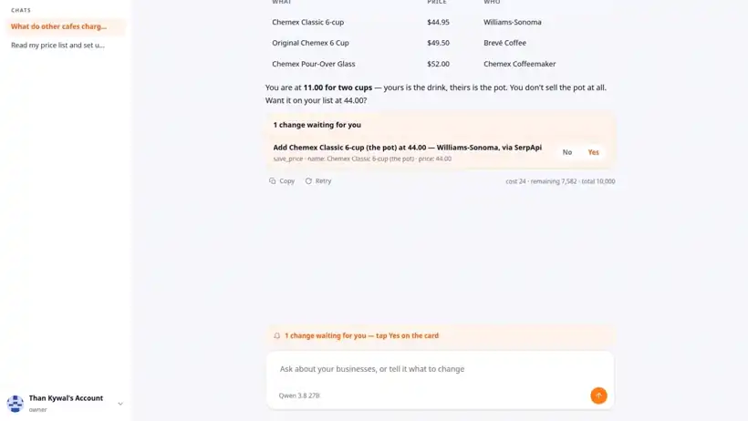
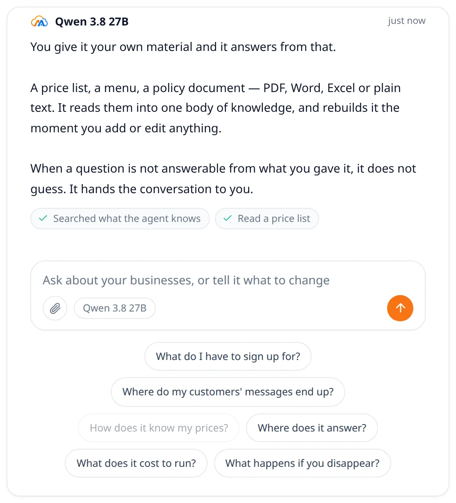
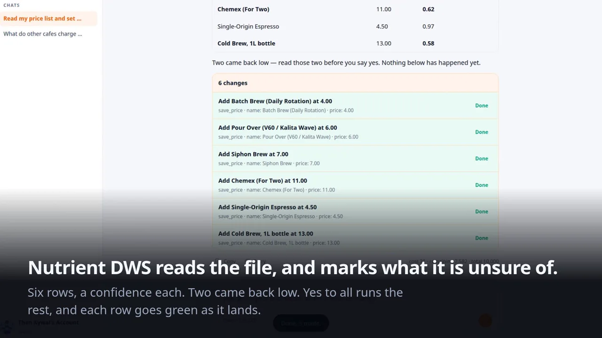
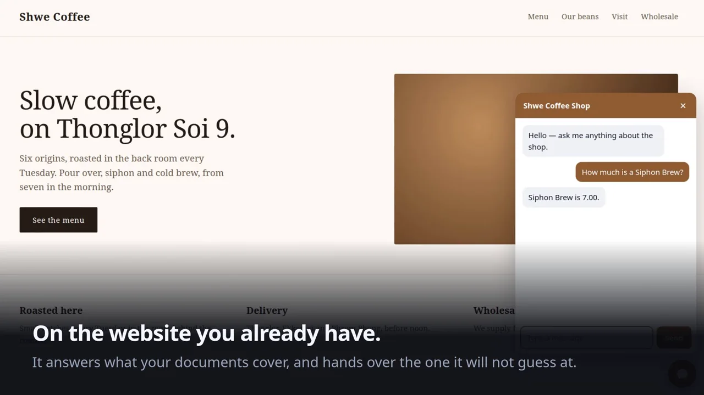
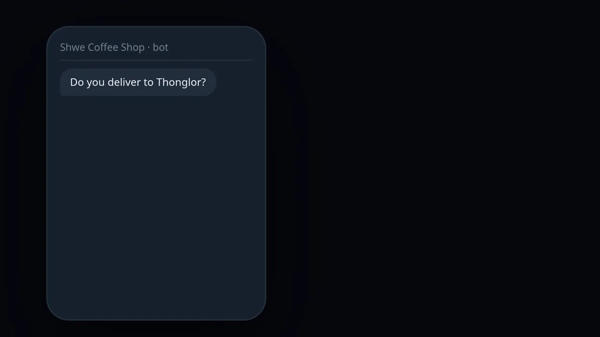
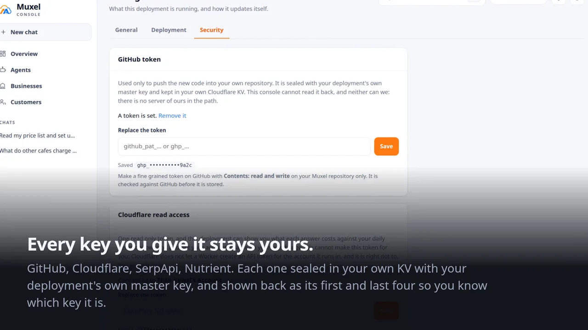

[English](README.md) · [မြန်မာ](README.my.md) · [ไทย](README.th.md) · [日本語](README.ja.md) · **中文**

# Muxel

自托管的 AI 客服助手。它根据你自己的价目表和店铺规定,在 Telegram 上回复你的
客户,并且完全运行在你自己的 Cloudflare 账户里。

[](https://deploy.workers.cloudflare.com/?url=https://github.com/thankywal/muxel)

<p align="center">
  
</p>

<p align="center"><em>店主问别家咖啡馆卖多少钱。SerpApi 的三个引擎给出答案,并标明是哪
一家在卖。一张卡片,点一下就好。几秒之后,店铺自己的网站就开始卖这件它此前并不卖的
东西。这两个画面之间,除了那一下点击写进去的价目表,再没有别的东西。</em></p>

第一次使用?请先阅读[开始之前](#开始之前)。一共是三样东西、大约十分钟:两个
免费账号,再加一个你自己想的密钥。全程都不需要 Telegram 账号。

Muxel 没有自己的服务器,没有自己的数据库,也没有账号系统。你的文档、你的对话
和你的凭据,永远不会离开由你掌控的基础设施。

## 它长什么样

| | |
| --- | --- |
|  |  |
| **你自己的助手,看得到整个部署。**它会读遍每一家店铺、每一份价目表、每一条规则和每一段对话,并提出它自己无法执行的改动。每一次写入都是一张你点“是”的卡片,它用过的工具就列在它说的话下面。 | **有了置信度,人来把关才有意义。**Nutrient DWS 读的是原始文件本身,并把它拿不准的地方标出来,于是四十行看上去同样确定的数据,变成值得你花时间去看的那两行。 |
|  |  |
| **就在你已经有的那个网站上。**只要一个 `<script>` 标签,画在 shadow root 里,并取用你自己的配色。你的文档里写到的它就回答,只能靠猜的那一个,它交给人。 | **Telegram 上也一样。**同一个助手,同一份知识,只是换了一道门;不是必需的,什么时候想加都可以。 |
|  | |
| **每一把密钥都还是你的。**GitHub、Cloudflare、SerpApi、Nutrient,每一把都用你这次部署自己的主密钥封存在你自己的 KV 里;显示回来的只有开头和结尾各四位,够你认出它是哪一把。 | |

上面每一张图都是这个产品在真实运行,不是效果图。console 由本仓库提供,界面由它自己的
CSS 绘制;那个对话气泡则在一个并不属于我们的普通网站上。

## 它能做什么

* 一个完全用按钮操作的 console:在浏览器里打开
  [app.muxel.site](https://app.muxel.site),想要的话再加一个 Telegram bot 也
  可以。两种方式都一样,设置完成之后不需要后台面板,也不需要改配置文件。
* 每家店铺配一个面向客户的 bot,它会根据你上传的价目表、店铺规定和商品信息
  来回答问题。
* 回复都以检索到的资料为依据,所以助手会引用你的文档里写的内容,而不是自己
  编一个答案;遇到不知道的事情,它会直接说不知道。
* 它记得自己在跟谁说话。系统会从对话中提炼出长期有效的信息,所以老客户回来时
  不用把话再说一遍。
* 一份客户名单,带有阶段标记和备注,并且删除就是真的删除。
* 由你自己撰写的指令,可以在 console 里用一段文字或一个 markdown 文件整体
  替换,如果改坏了还能撤销。
* 一次部署可以管理任意多家店铺,每家店铺之间互相隔离。

## 开始之前

两件事,都免费,大约十分钟。它们都不会要求你填银行卡,而且你自始至终都不需要
写任何代码。

### 1. 一个 Cloudflare 账户

Muxel 会运行在这里,你的文档和对话也都保存在这个账户里。到
[dash.cloudflare.com/sign-up](https://dash.cloudflare.com/sign-up) 注册,然后
点开它发给你的邮件完成确认。保持在免费方案就可以。Muxel 特意避开了所有需要
绑卡的功能,所以不会有人向你要卡号。

已经有账户了?直接登录,然后往下看就行。

### 2. 一个 GitHub 账户

Cloudflare 会以你自己的名义保存一份这份代码的副本,这样在你更新时它就能重新
构建你的助手。到 [github.com/signup](https://github.com/signup) 注册。

你不需要在那里写任何东西。设置完成后就可以关掉它、把它忘掉。

要准备的就这些。没有什么要你去想,没有什么要你记下来,也没有哪个框要你填:
你的部署会自己生成 console key,并在它跑起来时拿给你看。Telegram 是随时可以加的
另一道门,下面 **Telegram,如果你想要**那一节说明它能带来什么。

## 在浏览器里 deploy

点击这个按钮,或者把下面这个链接复制到浏览器里打开:

[](https://deploy.workers.cloudflare.com/?url=https://github.com/thankywal/muxel)

```
https://deploy.workers.cloudflare.com/?url=https://github.com/thankywal/muxel
```

在表单出现之前,Cloudflare 会先带你走三步。如果你还没有登录,它会请你登录;
它会请你连接 GitHub 账户;它还会请你在上面安装 Cloudflare 的 GitHub 应用。请
同意安装,因为 Cloudflare 正是靠它来创建你那份代码副本,并在你更新时重新构建。

如果你的 GitHub 账户里还留着以前项目安装的 **Cloudflare Workers and Pages**
应用,请先到
[github.com/settings/installations](https://github.com/settings/installations)
把它卸载,再让这一步安装当前的应用。旧的那个应用可能只复制仓库的一部分,结果
就是 deploy 显示成功,但什么都跑不起来。处理方法见
[docs/DEPLOY-RECOVERY.md](docs/DEPLOY-RECOVERY.md)。

在表单里,KV 命名空间和 D1 数据库直接用它建议的名字就好,然后填三个框:两个
给 Vectorize 索引,再加上你的 console key。

**Vectorize 索引会问你两个无法替你预先填好的值。** 这两个值在索引创建时就
固定下来,而 Worker 配置里没有对应的字段,所以这两个框是空的:

| Vectorize 字段     | 值       |
| ------------------ | -------- |
| 维度 Dimensions    | `1024`   |
| 度量方式 Metric    | `cosine` |

填错了也不再是致命问题。嵌入向量会按索引创建时的设定自动适配,设置页面也会
告诉你后果是什么。数字填大了只是浪费空间,别的没有影响,因为用零补齐并不会
改变余弦相似度。数字填小了,嵌入向量会被截短以适应索引,搜索会变得不那么准确,
这值得改正,但不会让任何功能停摆。

表单到这里就全部结束了。没有密码框,没有给 Telegram bot 留的框,也没有任何一个
需要你动脑筋的框。按 **Create and deploy** 就好。

其余的一切都会自动配置好:deploy 这一步会向 Worker 发出第一个请求,让它知道
自己的地址,而你哪天加了 Telegram bot,连接 webhook 的也正是这件事。

构建完成后,Cloudflare 会给你 Worker 的地址。**打开它。**回应你的那个页面,就是
你的部署在说它已经准备好了,同时它会把 console key 交给你——一串它自己生成的
长随机字符。因为一台刚刚被创建出来的机器想出来的密码,比一个还没见过这东西的人
想出来的密码更好。

把那串密钥复制下来,存在你放其他密码的地方。然后打开
[app.muxel.site](https://app.muxel.site),把 Worker 的地址粘进去,再把密钥粘进去。
这个 console 就是你的私人控制面板。在里面添加一家店铺,它会问你店铺叫什么名字。

那个页面由我们的域名提供,但它不保存你的任何东西。它必须问你要地址,因为它
确实不知道;你粘进去的密钥也是由你自己的 Worker 来验证,不是由我们。

你自己 Worker 的那个页面,会一直显示这串密钥,直到第一次有人登录为止,之后就
不再显示:地址是公开的,一旦 console 有了主人,继续把密钥印在上面,等于是把它
交给下一个打开这个页面的人。如果你在登录之前就弄丢了,刷新那个页面即可。如果是
登录之后弄丢的,[console 里有什么](#console-里有什么)那一节说明怎么换一把。

**如果那个地址回答的是 `Hello world`,说明这次 deploy 并没有完成。**Cloudflare
在构建之前会把这个仓库复制到你的 GitHub 账户,而这一步偶尔会失败,面板却仍然
显示成功。此时 Muxel 没有任何部分在运行,也就没有任何东西能把问题告诉你。
[docs/DEPLOY-RECOVERY.md](docs/DEPLOY-RECOVERY.md) 说明了如何确认,并给出两种
把安装做完的办法,其中一种完全不需要 GitHub。

<details>
<summary>deploy 之后,把你的副本设为 private</summary>

Cloudflare 会把这个仓库复制到你自己的 GitHub 账户下,而这份副本创建出来是
**公开的**。

店铺数据永远不会进到那里。文档、对话和客户记录都存放在 D1 和 Vectorize 里,
而 Worker 根本没有写入 git 的能力。secret 也不会被写进去:它们保存为 Worker
secret,并且 `.dev.vars` 是被忽略的。

副本里确实保存的,是你账户中各项资源的标识符,它们在部署时被写进了
`wrangler.jsonc`。这些不是凭据,没有你的账户也读不到任何东西,但也没有必要
公开。请在 Settings、General、Change visibility 里把仓库设为 private。

设置页面会替你检查这一点,只要副本还是公开的,它就会给出一个直接跳到该设置的
链接。你照做之后提示就会消失,所以既不用记住什么,也不用手动关掉什么。Muxel
自己做不了这个改动:仓库是由 Cloudflare 的 GitHub App 创建的,副本里没有
`.github` 目录,我们的任何 workflow 都无法在其中运行,而且 Worker 不持有、也
不应该持有任何 GitHub 凭据。

设为 private 之后,构建照常工作。Cloudflare 是以已安装的 GitHub App 的身份
访问你的仓库,它在你授权的仓库上持有 `contents: write` 权限,而这种安装型
访问权限与仓库是否公开无关。

只有提供按钮的那个仓库需要保持公开,那就是本仓库,不是你的副本。

</details>

## Telegram,如果你想要

上面这些都不需要 Telegram,没有 Telegram 的部署也是完整的,不是只做了一半。
Telegram 带来的是两件互相独立的事,你可以只要其中一件,也可以两件都不要。

* **一个装在口袋里的 console。**和浏览器里那个是同一个控制面板,只是变成了
  用按钮操作的 bot;客户问到助手不该回答的问题时,提醒也会送到这里。
* **一个客户本来就在用的渠道。**每家店铺配一个 bot,按你的文档回答问题,适合
  客户就在 Telegram 上的店。如果你的客户在网站上,console 还能为你的网站生成
  一个对话气泡,那条路完全用不到 Telegram。

两件事什么时候加都可以。在此之前设置好的东西不会丢,加它们也不需要重新
deploy。

### console bot

在 Telegram 里打开 [@BotFather](https://t.me/BotFather),发送 `/newbot`。它会
回复一串很长的 token,样子像 `8012345678:AAH...`。

然后给 [@userinfobot](https://t.me/userinfobot) 发送 `/start`。它会回复一个
数字,console 就是靠这个数字,把你和其他找到你 bot 的人区分开。别人无法操作它。

这两个值都填进你的 Worker,位置在 Cloudflare 控制台的 **Settings**、
**Variables and Secrets**:

| 设置项              | 值                                 |
| ------------------- | ---------------------------------- |
| `ADMIN_BOT_TOKEN`   | BotFather 给你的 console bot token |
| `OWNER_TELEGRAM_ID` | @userinfobot 给你的数字,只填数字  |

这两个是一对,只填一个不起任何作用。填好之后打开一次你的 Worker 地址,让它
连上 webhook,再给 bot 发送 `/start`。

没有比这更早的地方可以做这件事。deploy 表单只问 console key 这一项,所以
console bot 永远是加到一个已经在跑的部署上的。上面那些步骤不必等 Telegram,
也正是因为这样。Cloudflare 给你的那个 Worker 地址上的设置页面,同样会点出这
两项设置的名字,说的也是同一件事。

### business bot

这一个是客户会联系的,所以要取店铺的名字。再给 BotFather 发一次 `/newbot`,建
第二个 bot,绝对不要用 console bot 那一个,它的 token console 本来就会拒绝。然后
在 console 里把它加到对应的店铺上。

| Bot          | 谁会给它发消息 | 名字可以取成       |
| ------------ | -------------- | ------------------ |
| Console bot  | 只有你         | My Muxel Console   |
| Business bot | 你的客户       | 你店铺的名字       |

## 保持更新

更新**不是**自动的,这一点值得把原因说清楚。

deploy 按钮创建的是一份独立的副本,而不是 GitHub fork,所以没有 Sync fork
按钮,也没有任何东西把你的副本连回这里。它复制项目时还会**去掉 `.github`
目录**,因为导入过程无法创建 workflow 文件。因此本仓库里附带的任何更新
workflow,都不会出现在你的副本里。

会自动发生的事情是:你的部署会检查本仓库有没有新版本,有的话就会在你已经在用
的地方告诉你。网页 console 会显示一个**部署已落后**的标记,Settings、Deployment
里会写明你在哪个版本、最新的是哪个。如果你加过 console bot,它也会在那边给你
发消息,每个版本只提醒一次。你不用记着去看。

### 应用一次更新

```bash
git clone https://github.com/<you>/muxel.git && cd muxel
git remote add upstream https://github.com/thankywal/muxel.git

# every time, from here on
git fetch upstream
git checkout upstream/main -- .
git checkout HEAD -- wrangler.jsonc      # keeps your resource identifiers
git commit -am "Update from upstream" && git push
```

push 会触发你的 Workers Build,它会重新部署并完成设置。你的数据、设置和 bot
都不会受到影响。

### 让它自动进行

只要手动做一步,之后就能每天自动更新。在你 GitHub 上的副本里,选择 **Add
file**,再选 **Create new file**,把文件命名为 `.github/workflows/update.yml`,
然后粘贴[本仓库里的这个 workflow](.github/workflows/update.yml)。虽然导入过程
无法创建 workflow 文件,你自己手动创建是可以的。

然后检查 **Settings**、**Actions**、**General**、**Workflow permissions** 是否
设为 *Read and write*,否则这个任务无法向你自己的仓库 push。

只有当上游提交自己的测试通过时,更新才会被应用,所以有问题的提交不会在无人
看管的情况下进入一家正在营业的店铺。你也可以随时在 Actions 标签页用 **Run
workflow** 手动运行它。

你的副本是跟随上游的,它的历史会被替换而不是合并,本地对代码的修改不会保留
下来。需要调整时请改用 console 来配置。如果你打算改动代码,就不要添加这个
workflow。

## 在终端里 deploy

这一节是写给开发者的,内容保留在英文版 README 里,请参见
[英文 README 的这一节](https://github.com/thankywal/muxel#deploy-from-a-terminal)。

## 选择模型

每家店铺都会保存一个模型名称。要更换它,在 console 里按一下按钮就行,不需要
重新 deploy。

| 模型              | 每 1,000 次回复的成本 | 是否需要服务商密钥 |
| ----------------- | --------------------- | ------------------ |
| Gemma 4 26B       | 约 0.33 美分          | 否                 |
| Llama 3.3 70B     | 约 0.86 美分          | 否                 |
| GPT-5.6 Luna      | 约 0.76 美分          | 是                 |
| Claude Sonnet 4.5 | 视情况而定            | 是                 |

只用 Cloudflare 登录的话,能用的只有 Workers AI 的模型。要选用其他服务商,就得
先在你的 AI Gateway 里存一个密钥,所以 console 会把那些模型标记出来,而不是让
你选中一个在客户发来第一条消息时就会失败的模型。

Gemma 4 是默认模型。按一次检索回复实测,每一千次回答大约花费三分之一美分,而
每天大约 880 次回复都在免费的每日额度之内。嵌入向量始终使用 `bge-m3`,它支持
多语言,而且基本上是免费的。

## 两种 bot

两个都不是必须的,但区分这两者很重要,console 就是围绕这个区分来设计的,它也
不允许把两者混在一起。

| | Console bot | Business bot |
| --- | --- | --- |
| 谁会给它发消息 | 只有你 | 你的客户 |
| 它能管到什么 | 所有店铺 | 恰好一家 |
| 它从哪里来 | `ADMIN_BOT_TOKEN`,在 Worker 的设置里 | 在 console 里为每家店铺分别添加 |
| 是否属于某家店铺 | 从不 | 是,属于它服务的那一家 |

在网页 console 里,店铺是用名字建起来的,bot 之后再挂上去,不挂也行。在
console bot 里则正好相反:添加店铺时问的是 token 而不是名字,因为在那里,一家
店铺是因为有 bot 在服务它才存在的,bot 自己的名字也就成了店铺的名字。

有一件事哪个 console 都不会做:把 console bot 挂到某家店铺上。它会拒绝自己的
token,免得那个控制面板悄悄变成客户的聊天窗口。

## console 里有什么

设置完成之后,所有操作都在 console 里通过按钮完成:在浏览器里打开
[app.muxel.site](https://app.muxel.site),加过 console bot 的话在那里也一样。

| 页面 | 里面有什么 |
| --- | --- |
| Data(资料) | 上传的文件,每个文件一行,每一行都能删除 |
| Products(商品) | 一次输入一件,或者批量上传的商品 |
| Customers(客户) | 所有写过消息的人,带有阶段、备注和记忆 |
| Instructions(指令) | 你为助手写的规则,可以撤销 |
| Bots(bot 管理) | 客户联系的那些 business bot,以及添加新的 bot |

Data 支持 PDF、Word、Excel、CSV、TXT、Markdown、JSON 和 JSONL。纯文本格式会被
直接读取。表格和文档会经过平台的转换器处理,读不出来的 PDF 会再针对文字层重试
一次,这正是从 Excel 导出的价目表能用的原因。

每个文件都必须属于某家店铺,所以 console 会先请你打开一家店铺再接收上传,而不
是自己去猜。

商品功能与文件并存,是因为文件只能整份替换。改一个价格不应该意味着重新上传整本
目录。商品按 `name | price | description` 的格式录入,一行一件,可以手动输入
也可以上传,每一件都能单独删除。每一次改动都会重建助手所掌握的内容。

删除一家店铺时会先请你确认,然后把它的文件、商品、客户、bot 和向量一并删除。

### 语言

console 支持 English、ไทย、中文 和 မြန်မာ。语言是按操作者设置的,切换后每一个
按钮都会改变,而不只是下一个页面。它与店铺回复客户时所用的语言是两回事。

### 如果你弄丢了 console key

在 Cloudflare 控制台的 **Settings**、再到 **Variables and Secrets** 里,加一个
名为 `CONSOLE_KEY` 的 secret,至少 16 个字符。你在那里设定的密钥优先于部署自己
签发的那把,所以从下一个请求起,它就是你的密钥。

这么做同时会终止旧密钥开出的所有会话。这正是它的用意:它是你把一把已经流出去的
密钥收回来的办法,也是部署为什么要在每个会话上打下开启它的那把密钥的印记,而不是
认定一个已登录的浏览器永远都还是你的。

## 助手什么时候不该回答

助手依据你给它的文档来回答。有些问题在文档里找不到:一个没人写下来的折扣、一次
投诉、一笔特别订单。对这些问题乱猜,正是会让你失去客户的那种错误,所以它不猜。

它会改为告诉客户稍后会有人跟进,同时通知你。提醒会出现在 console 里,并带有一个
可以直接打开这段对话的按钮。

在 console 的客户页面上:

| 操作                          | 会发生什么                                               |
| ----------------------------- | -------------------------------------------------------- |
| **查看对话**                  | 完整的聊天记录,每一行都标明是谁说的                     |
| **接手**                      | 助手在这段对话里保持安静                                 |
| **发送消息**                  | 你打字,客户会通过 business bot 收到                     |
| **交回给助手**                | 它继续回答                                               |

在你亲自回复期间,助手会退到一边,并把客户写的内容转发给你,这样就不会有两个
声音同时回复同一个人。你发出的消息会作为对话的一部分被记录下来,也就是说,当你
把对话交回去时,助手是读过这些内容的。

console 首页的 **等待人工** 会列出所有需要你处理的对话,涵盖你的全部店铺。

助手答不上来的一个问题,并不会让它在这段对话余下的部分都闭嘴。它会继续回答其他
所有问题,因为遇到一个难题就从此沉默,比那个难题本身更糟。

## 指令和文档是两回事

console 把它们分开管理,因为助手对两者的信任程度必须不同。

| | 指令 | 文档 |
| --- | --- | --- |
| 由谁撰写 | 你 | 你上传,但内容常常来自供应商或客户 |
| 如何对待 | 助手要遵守的规则 | 它可以引用的事实 |
| 放在哪里 | 系统提示词里 | 引用分隔符之内 |

指令是你自己写的文字,所以它决定语气和规则。文档是不受信任的输入,所以助手事先
就被告知要把它们当作数据来读。PDF 里的一句话无法改变助手的行为,而“不许编造
价格”这条规则,无论你的指令怎么写都依然有效。

你随时都可以把一份文档发给 console,它会加入你最后打开的那家店铺的知识。指令则
要在 Instructions 页面上明确替换,可以用一条消息或一个 `.md` 文件,上一个版本会
被保留,所以改坏了可以撤销。

## 记忆

系统每隔几条消息,就会从对话中提炼出关于这位客户的信息,并存到他的记录里。老
客户回来时,不用再说一遍买过什么、怎么付款。

这些信息存放在 D1 里,按键读取,而不是做成向量再搜索。一个人累积的信息是几十
条,而不是几千条,所以一次带索引的查询就能全部取回。这样整份 Vectorize 额度都
可以留给文档,语义搜索用在那里才值得。

客户页面会显示记住了哪些内容,并且既可以只清除这些信息,也可以把这个人整个
删除。

## 进不去的时候

两道门都是你自己 Worker 上的 secret,所以都能在 Cloudflare 控制面板的
Settings、Variables and Secrets 里恢复。我们这边一个都恢复不了:两个我们都没有
留副本。

* **忘了 console key?**把 `CONSOLE_KEY` 改成一个新的,再用新的登录。没有什么
  要重置,也不用等邮件。
* **console bot 丢了?**改掉 `ADMIN_BOT_TOKEN`,然后访问一次你 Worker 地址上的
  `/setup`。这条路径会重写保存的凭据,也会重写 webhook。

如果你还进得去 console,想换掉 console bot,就打开 Bots,选择 Replace console
bot,然后把新的 token 发过去。旧的 bot 会先被解除关联,这样两个 bot 不会同时
回复,新的 bot 会在同一段对话里向你确认。

## 运行成本

Muxel 本身不收任何费用,一家小店铺完全放得进 Cloudflare 的免费方案。

| 资源       | 免费额度                              | 在这里意味着什么                  |
| ---------- | ------------------------------------- | --------------------------------- |
| Workers AI | 每天 10,000 neurons                   | 用 Gemma 4 大约每天 880 次回复    |
| Vectorize  | 存储 5 M 维度,查询 30 M 维度         | 大约 4,800 个文档片段             |
| D1         | 5 GB,每天 100 k 行写入               | 远超一家店铺会产生的量            |
| Workers    | 每天 100,000 次请求                   | 远超一家店铺会产生的量            |

按每个向量 1,024 维计算,Vectorize 的存储额度大约相当于 4,800 个片段,量级上
接近一千页的价目表和店铺规定。

超出推理额度之后,每 1,000 neurons 收费 0.011 美元,所以越过免费线的代价是几
美分,而不是换一个套餐。唯一需要预先花钱的事情,是选用其他服务商的模型,因为
那笔钱你要直接付给那家服务商。

### 查看你已经用了多少

console 里有一个 **Usage** 页面。不需要任何配置,它就能告诉你这次部署今天回答了
多少内容、用掉了多少 token,因为这些是 Muxel 自己统计的。

整个账户的总量是另一回事,因为你的其他 Workers 也在用同一份额度,而这个问题只有
Cloudflare 能回答。要显示这些数字,请创建一个只带 **Account Analytics: Read**
权限、别的权限都没有的 API token,然后在 Worker 的 Settings、Variables and
Secrets 里添加两个 secret:

| Secret          | 值                                       |
| --------------- | ---------------------------------------- |
| `CF_ACCOUNT_ID` | 你的账户 id,在控制面板的网址里          |
| `CF_API_TOKEN`  | 你刚刚创建的那个只读 token               |

之后这个页面会显示:今天用掉的 neurons 与每日额度的对比、按模型细分的用量、
Worker 请求数、Vectorize 的搜索与存储,以及今天剩余额度还够回复多少次的估算。
这个估算来自你自己的回复实际花掉的量,而不是某个公布的费率,所以就算你换了
模型,它依然准确。

这个 token 是只读的。它不能 deploy,不能修改配置,也读不到你的数据,而且 Muxel
从不把它显示出来。

Muxel 特意不使用 R2 存储桶。它的用途只是归档上传文件的原件,而这些原件不会再被
任何功能读取,何况即使在 R2 自己的免费额度内,启用它也要求填写付款方式。如果你
确实想保留原件,添加一个名为 `DOCUMENTS` 的绑定即可。

## 安全

* 店铺数据永远不会离开你的 Cloudflare 账户,也永远不会进入代码仓库。Worker
  没有任何写入 git 的途径。
* bot token 在进入数据库之前会用 AES-GCM 加密封存,所以单凭一份数据库导出,
  得不到任何可用的凭据。
* 粘贴到 console 里的 bot token 会立刻从聊天记录中删除。
* console key 用常数时间比对,除了你自己 Worker 的设置之外不存在任何地方,不足
  16 个字符会被拒绝,而不是当成一把弱一点的锁收下。登录时会生成一个会话 token,
  存下来的只有它的哈希,所以拿到一份你的 KV 也换不来能用的登录。
* webhook 会用每个 bot 各自的 secret 做常数时间比对来验证身份。未知路径和错误
  的 secret 都返回同样的 404,所以没人能靠试探找出有效的接口地址。
* 回复流程不向模型开放任何工具。检索到的文档都带有分隔符,并被明确标示为引用的
  数据,所以上传文件里的文字无法改变助手的行为方向。
* 所有涉及店铺内容的查询,都在数据层而不是在处理逻辑里,按店铺标识符做过滤。

发现漏洞请通过 [SECURITY.md](SECURITY.md) 报告。

## 开发

这一节是写给开发者的,内容保留在英文版 README 里,请参见
[英文 README 的这一节](https://github.com/thankywal/muxel#development)。

## 项目状态

0.1 版本面向 Cloudflare,console 在浏览器里,想要的话也可以在 Telegram
里。回调编解码、文本切分、凭据封存、记忆提取
解析器和检索流程都有测试覆盖,整条流程也已经在一个真实账户上做过端到端运行。
console 还没有在已部署的 bot 上实际检验过。

## 许可证

Apache 2.0。请见 [LICENSE](LICENSE)。

Muxel 是本项目作者的商标。该许可证授予你使用、修改和再分发这些代码的权利,但
不授予你用 Muxel 这个名字来标识你自己发行版本的权利。
